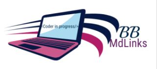
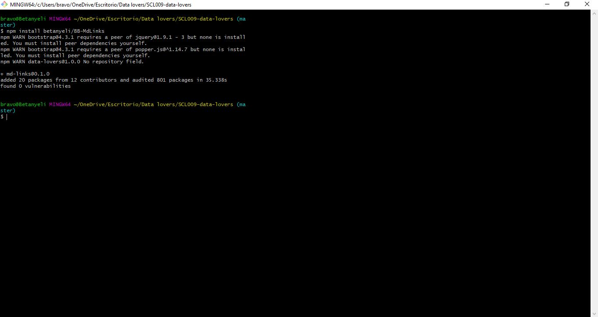
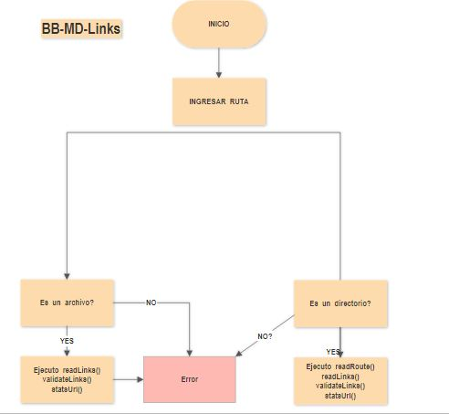

# BB-MDLinks versión BETA :computer:

## Preámbulo

[Markdown](https://es.wikipedia.org/wiki/Markdown) es un lenguaje de marcado
ligero muy popular entre developers. Es usado en muchísimas plataformas que
manejan texto plano (GitHub, foros, blogs, ...), y es muy común
encontrar varios archivos en ese formato en cualquier tipo de repositorio
(empezando por el tradicional `README.md`).

Estos archivos `Markdown` normalmente contienen _links_ (vínculos/ligas) que
muchas veces están rotos o ya no son válidos y eso perjudica mucho el valor de
la información que se quiere compartir.

Esta aplicación está orientada a leer y analizar archivos
en formato `Markdown`, para verificar los links que contengan y reportar
algunas estadísticas.

### Versión 0.1.6 [beta]

:warning: En esta versión sólo está funcional la lectura de archivos con extensión "md", cuyo resultado arroja un Objeto el cuál contiene las Url encontradas en el archivo ó aquellos vínculos que se encontraran en un directorio con archivos "md". :warning: Además de esto, se visualizarán las estadísticas correspondientes al *Total de links encontrados* , *Links únicos*, y *Links Rotos*.
El usuario deberá asegurarse de colocar la ruta correcta al directorio o al archivo.
Se espera poder implementar la funcionalidad de las opciones `--validate` y `--stats` para darle mayor autonomía al usuario respecto a la información que desea mostrar.

# Instrucciones.

1. Instalar dependencia desde la terminal de Git ó de tu editor de texto con el comando `npm install betanyeli/BB-MdLinks` ó desde 
[NPM](https://www.npmjs.com/package/bb-mdlinks) con ` npm i bb-mdlinks `
.
2. Ejecutar el comando `md-links` seguido del directorio ó archivo que desee leer. :file_folder:

# Flujo de app

# Lenguajes, argumentos y dependencias:
Esta librería está desarrollada en *JavaScript*, usando las siguientes dependencias externas a nodejs:
- Module `node-fetch`
- Module `chalk`
- Module `fileHound`
- Test con `eslint-plugin-jest`
- Test con `jest`

Además de aquellas dependencias propias de nodejs:
- Module `file system` with `readFile`
- Module `stats` with `isFile() or isDirectory()`
- Module `process` with `process.arvg[]`
- Module `commandPath`

Otros:
- Promises
- Async functions

#Planificación:
Se dividió el proyecto en dos springs de una semana cada uno.
Se utilizó el tablero de github PROJECTS, que pueden desplegar [aquí](https://github.com/betanyeli/BB-MdLinks/projects)
[issues](https://github.com/betanyeli/BB-MdLinks/issues)

**Desarrollado por Betányeli Bravo para Laboratoria**